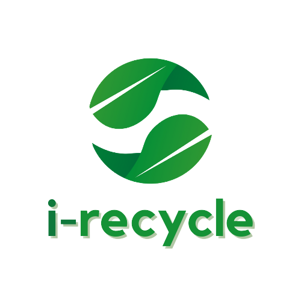

 

  
  
  

    
    
  

  <h1 align="center">i-recycle Project</h1>
  
   
Garbage Classifier Application

   
## Team Members

| Student ID |             Member             |        Path        |                Project Role                |                                                  Contacts                                                  |
| :--------: | :----------------------------: | :----------------: | :----------------------------------------: | :--------------------------------------------------------------------------------------------------------: |
|  M3192859  |        Deborani Siagian        |  Machine Learning  |  Machine Learning Engineer |     [![deborani-linkedin][linkedin-shield]][deborani-linkedin-url][![deborani-github][github-shield]][deborani-github-url]     |
|  M3192867  | Yehezkiel Edininta Simanjuntak |  Machine Learning  |         Machine Learning Engineer          |     [![kiel-linkedin][linkedin-shield]][kiel-linkedin-url][![kiel-github][github-shield]][kiel-github-url]     |
|  C0070726  |       Aditya Paramananda       |  Cloud Computing |              Cloud Engineer              | [![adit-linkedin][linkedin-shield]][adit-linkedin-url][![adit-github][github-shield]][adit-github-url] |
|  C0080773  |    Rismanda Tyas Kusumadewi    | Cloud Computing |              Cloud Engineer             | [![manda-linkedin][linkedin-shield]][manda-linkedin-url][![manda-github][github-shield]][manda-github-url] |
|  A1931925  |      Setyo Bagus Nugraha       | Mobile Development    |                      Mobile Developer                | [![setyo-linkedin][linkedin-shield]][setyo-linkedin-url][![setyo-github][github-shield]][setyo-github-url] |
|  A3192864  |         Leonardo Wijaya        |  Mobile Development   |                      Mobile Developer              |     [![leo-linkedin][linkedin-shield]][leo-linkedin-url][![leo-github][github-shield]][leo-github-url]     |

## About the Project
i-recycle is an application that can detect types of waste and provide education to the public about waste. This application can help you to be able to contribute in saving the earth by recycling the garbage that we have at home. Garbage can also be turned into valuable and reusable items. We use Convolutional Neural Network for image classification. To improve our machine learning model we use transfer learning. We chose to use a pre-trained model for image classification, namely InceptionV3.

## Dataset
In this project we use a dataset from Kaggle which contains images of garbage divided into 12 classes to classify the types of waste. 

Resource: https://www.kaggle.com/mostafaabla/garbage-classification

## Model Creation Flow
1. Interested in solving problems regarding waste management so we're looking for a dataset about garbage.
2. Found a dataset on Kaggle containing 15,150 images from 12 different classes of household garbage; paper, cardboard, biological, metal, plastic, green-glass, brown-glass, white-glass, clothes, shoes, batteries, and trash.
3. Create colab and upload data from Kaggle to Google Colaboratory.
4. Prepare the data.
   - Unzip the dataset
   - Split the dataset into training set and validation set
   - Data preprocessing (data augmentation)
5. Train the model with CNN (baseline model) and test the model.
6. Improve the model with transfer learning first by using ResNet50 then InceptionV3 and test the model.
7. Saved the model to h5 and then convert to TensorFlow lite with post-training quantization.

## Acknowledgement

  </img>

<!-- LinkedIn Link -->

[linkedin-shield]: https://img.shields.io/badge/LinkedIn--blue?style=social&logo=Linkedin
[deborani-linkedin-url]: https://www.linkedin.com/in/deborani-siagian-a97620185/
[kiel-linkedin-url]: https://www.linkedin.com/in/yehezkieles/
[adit-linkedin-url]: https://www.linkedin.com/
[manda-linkedin-url]: https://www.linkedin.com/in/rismanda-k-791b1211a
[setyo-linkedin-url]: https://www.linkedin.com/in/setyo-bagus-nugraha/
[leo-linkedin-url]: https://www.linkedin.com/in/leonardo-wijaya-67aa10194/

<!-- Github Link -->

[github-shield]: https://img.shields.io/badge/GitHub--blue?style=social&logo=Github
[kiel-github-url]: https://github.com/yehezkielesmjtk
[deborani-github-url]: https://github.com/DeboraniSiagian
[adit-github-url]: https://github.com/Aditpara20
[manda-github-url]: https://github.com/risma
[setyo-github-url]: https://github.com/setyobagus01
[leo-github-url]: https://github.com/Leonardowjy
